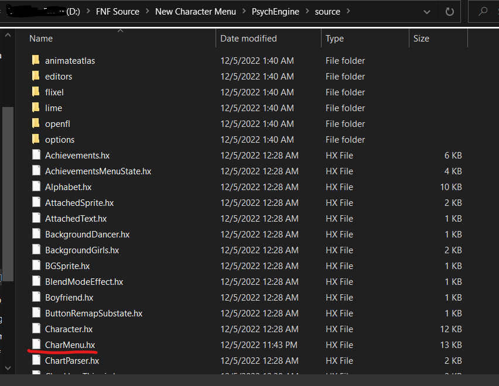
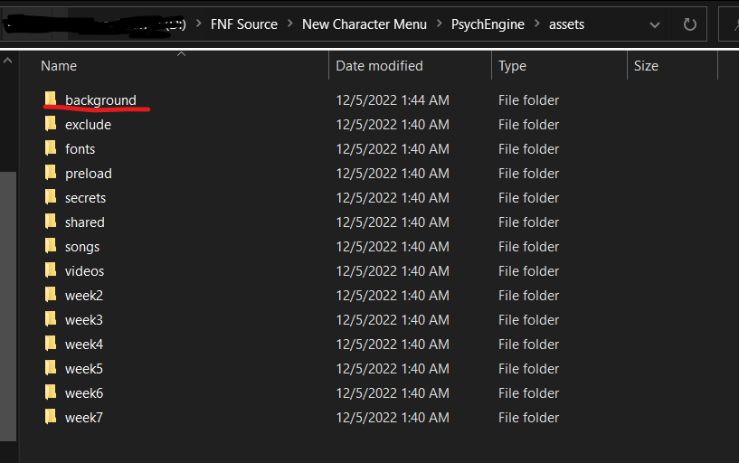
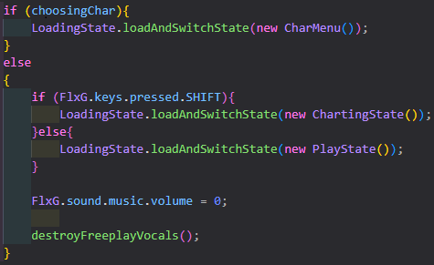

# Psych Engine Android Port Instructions

-   Step 1: Ensure that you have made the background folder a library path in the Project.xml file. If you don't know how, go [here](../../Main%20Assets%20Needed/).
-   Step 2: Download the Psych Android CharMenu [here](../../../CharMenuFiles/CharMenu-PsychAndroid.hx).
-   Step 3: Ensure that the location of the newly installed CharMenu is in the source folder.

    

-   Step 4: Ensure that the background folder is located in the assets folder.

    

-   Step 5: Add any characters you want in their specific variables.

    

-   Step 6: Move into whatever state you need, such as Freeplay (which I will be using for this example).
-   Step 7: Since I recommend a whole different way of accessing the menu on mobile, I would say just skip step 8 and 9 and just follow the readme file included with the [Psych Android CharMenu release](https://github.com/TorchTheDragon/TorchFNFExperiments/releases/tag/CharMenu-PyschAndroid).
-   Step 8: Add a boolean variable into said state underneath a name you will recognize, I used choosingChar, and set it to false (for now).

    

-   Step 9: Find where the state changes into a new one and add a else if statement to check if the Variable you created earlier is true so you can go into the CharMenu state.

    

-   Step 10: Build the engine, see if the engine at least runs, then close the application, set the variable you created earlier to true, then rebuild the application, run it, and see if the character menu appears.
-   Step 11: Done! For additional/extra instructions for special things, go to the [Extra](../Extra/) folder.
